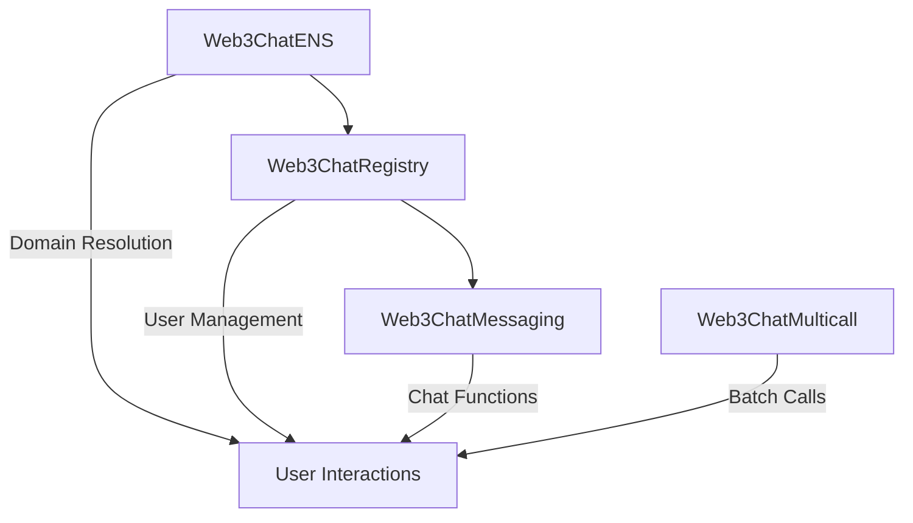

# Contract Verification Summary

## Deployment: web3Chat2
**Date**: September 17, 2025  
**Network**: Lisk Sepolia Testnet (Chain ID: 4202)

---

## ✅ All Contracts Successfully Verified!

### 1. Web3ChatENS Contract
- **Address**: `0x85c242c8EA73B35753a91971482Bd8cc5AB8e165`
- **Constructor Arguments**: None
- **Verification Status**: ✅ **VERIFIED**
- **Explorer Link**: https://sepolia-blockscout.lisk.com/address/0x85c242c8EA73B35753a91971482Bd8cc5AB8e165#code
- **Verification Command**: 
  ```bash
  npx hardhat verify --network lisk 0x85c242c8EA73B35753a91971482Bd8cc5AB8e165
  ```

### 2. Web3ChatRegistry Contract
- **Address**: `0xcaAF81887484Ee7029F090F0cCF637695725F13a`
- **Constructor Arguments**: 
  - `_ensContract`: `0x85c242c8EA73B35753a91971482Bd8cc5AB8e165`
- **Verification Status**: ✅ **VERIFIED**
- **Explorer Link**: https://sepolia-blockscout.lisk.com/address/0xcaAF81887484Ee7029F090F0cCF637695725F13a#code
- **Verification Command**: 
  ```bash
  npx hardhat verify --network lisk 0xcaAF81887484Ee7029F090F0cCF637695725F13a "0x85c242c8EA73B35753a91971482Bd8cc5AB8e165"
  ```

### 3. Web3ChatMessaging Contract
- **Address**: `0x32bf9023601997D833f9b00b5318A35f1C91a338`
- **Constructor Arguments**: 
  - `_registryContract`: `0xcaAF81887484Ee7029F090F0cCF637695725F13a`
- **Verification Status**: ✅ **VERIFIED**
- **Explorer Link**: https://sepolia-blockscout.lisk.com/address/0x32bf9023601997D833f9b00b5318A35f1C91a338#code
- **Verification Command**: 
  ```bash
  npx hardhat verify --network lisk 0x32bf9023601997D833f9b00b5318A35f1C91a338 "0xcaAF81887484Ee7029F090F0cCF637695725F13a"
  ```

### 4. Web3ChatMulticall Contract
- **Address**: `0x10650e68021dcB92EAd3a7e413b6EEe30f281578`
- **Constructor Arguments**: None
- **Verification Status**: ✅ **VERIFIED**
- **Explorer Link**: https://sepolia-blockscout.lisk.com/address/0x10650e68021dcB92EAd3a7e413b6EEe30f281578#code
- **Verification Command**: 
  ```bash
  npx hardhat verify --network lisk 0x10650e68021dcB92EAd3a7e413b6EEe30f281578
  ```

---

## Contract Architecture



## Key Features Verified

### Web3ChatENS
- ✅ Domain registration with first name extraction
- ✅ Access control for registry-only functions
- ✅ Domain ownership tracking

### Web3ChatRegistry
- ✅ User profile management
- ✅ ENS integration
- ✅ IPFS image storage support

### Web3ChatMessaging
- ✅ Private messaging between users
- ✅ Group chat functionality
- ✅ Message pagination
- ✅ Access control (registered users only)

### Web3ChatMulticall
- ✅ Batch contract calls
- ✅ Gas optimization utilities

---

## Network Information
- **Chain ID**: 4202
- **RPC URL**: https://rpc.sepolia-api.lisk.com
- **Explorer**: https://sepolia-blockscout.lisk.com
- **Network Name**: Lisk Sepolia

## Next Steps
1. ✅ Contracts deployed and verified
2. ✅ Frontend environment variables updated
3. ✅ Network configuration updated for Lisk Sepolia
4. 🔄 Ready for frontend testing and integration

All contracts are now live, verified, and ready for use on the Lisk Sepolia testnet!
